# ⚡ Active-loop Thermo-acoustic Instability Stabilization Prediction Model Using TCN-GRU Hybrid Architecture

<p align="center">
  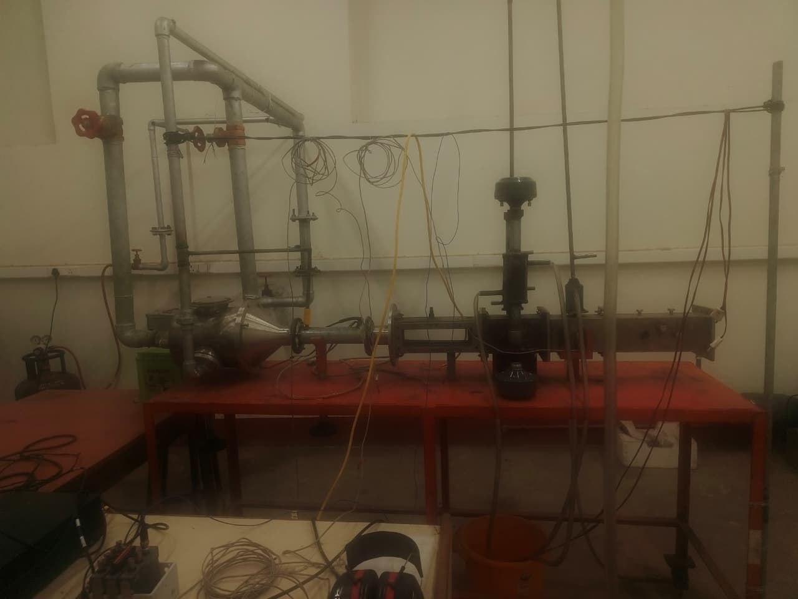
  <br/>
  <em>SUPRA experimental setup at IIT (ISM) Dhanbad — Dept. of Mechanical Engineering</em>
</p>

<p align="center">
  
  
  
  
  
  
</p>

---

<table>
<tr>
<td><b>👨‍💻 Developer</b></td>
<td>Dodla Deekshith Reddy</td>
</tr>
<tr>
<td><b>🏛️ Institute</b></td>
<td>Indian Institute of Technology (ISM), Dhanbad</td>
</tr>
<tr>
<td><b>🏢 Department</b></td>
<td>Mechanical Engineering</td>
</tr>
<tr>
<td><b>👨‍🏫 Supervisor</b></td>
<td>Prof. Rabindra Nath Hota</td>
</tr>
<tr>
<td><b>🔬 Co-Supervisor</b></td>
<td>Dr. Nandan Kumar Jha</td>
</tr>
<tr>
<td><b>📅 Programme</b></td>
<td>Summer Research Internship Scheme (SRIS) 2026</td>
</tr>
</table>

---

## 📌 About the Project

Thermoacoustic instability is one of the most dangerous phenomena in modern combustion engineering. In gas turbines, jet engines, and rocket combustors, heat released by the flame can lock in phase with the chamber's natural acoustic modes, creating a **runaway positive feedback loop** that causes:

- 💥 Structural fatigue of turbine blades and combustor walls
- 🔥 Flame blowout or flashback
- ⚙️ Complete mechanical failure of the combustion hardware

**Conventional passive solutions** (Helmholtz resonators, acoustic liners) only suppress instability at a fixed narrow frequency. They completely fail when operating conditions change.

**This project** solves this using a **Hybrid TCN-GRU Neural Network** that:
1. Continuously reads the live combustion pressure signal at 10,000 Hz
2. **Predicts the pressure wave 20 ms into the future**
3. Issues a phase-inverted counter-wave to the acoustic actuator early enough to physically cancel the instability

> **Core insight:** The system does not react to the wave — it predicts it. By the time the actuator's counter-wave physically arrives at the combustion chamber, it arrives in perfect destructive interference with the instability.

---

## 🛠️ Tech Stack

| Category | Tools |
|----------|-------|
| **Language** | Python 3.8+ |
| **Deep Learning** | TensorFlow / Keras |
| **Signal Processing** | NumPy, SciPy |
| **Data & Visualisation** | Pandas, Matplotlib |
| **Future Hardware** | NI LabVIEW, NI cDAQ 9177, NI 9222, NI 9322 |

---

## 🏗️ System Architecture

<p align="center">
  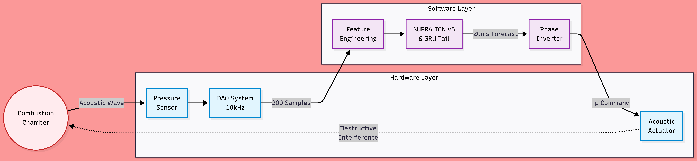
  <br/>
  <em>End-to-end active control pipeline — from pressure sensor to acoustic actuator</em>
</p>

### How it works — step by step:

| Step | What happens |
|------|-------------|
| 1️⃣ Sense | Piezoelectric transducer samples combustion pressure at 10,000 Hz |
| 2️⃣ Buffer | Most recent 200 samples (20 ms window) assembled in a circular RAM buffer |
| 3️⃣ Features | 3 multi-scale RMS envelopes computed on the fly (5ms, 50ms, 500ms) |
| 4️⃣ Predict | Hybrid TCN-GRU model predicts pressure 20 ms ahead in ~6.89 ms |
| 5️⃣ Invert | Predicted value multiplied by -1 (phase inversion) |
| 6️⃣ Cancel | Inverted signal sent to acoustic actuator — waves cancel each other ✅ |

---

## 🧠 Neural Network Architecture

<p align="center">
  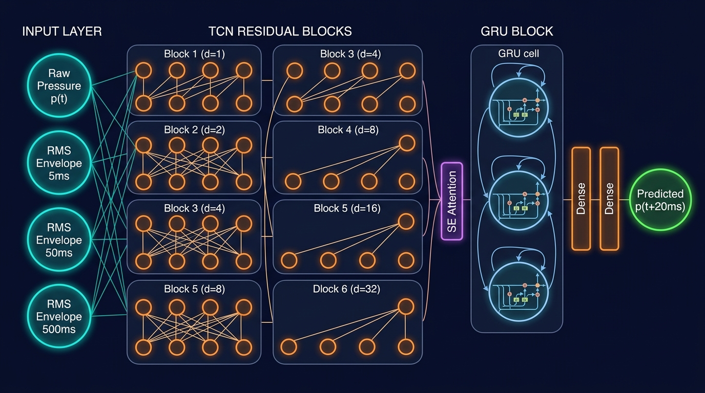
  <br/>
  <em>Hybrid TCN-GRU: 4-channel input → 6 dilated TCN blocks → SE-Attention → GRU tail → pressure prediction</em>
</p>

### Why Hybrid TCN + GRU?

| Model | Problem |
|-------|---------|
| **Pure LSTM** | Processes data one timestep at a time — too slow for 10,000 Hz real-time control |
| **Pure TCN** | Fast and parallel, but cannot detect "the instability is growing louder over time" |
| **Hybrid TCN-GRU** ✅ | TCN extracts waveform shape features fast. GRU tail adds sequential memory to track amplitude growth |

### Architecture Details

| Layer | Detail |
|-------|--------|
| **Input** | Shape `(200, 4)` — raw pressure + RMS at 5ms / 50ms / 500ms |
| **TCN Backbone** | 6 residual blocks, dilation `d=[1,2,4,8,16,32]`, SE-attention |
| **Receptive Field** | 253 samples — fully covers the 200-sample input |
| **GRU Tail** | Stride-8 downsampling → 25 steps → 32-unit GRU |
| **Output** | Single scalar — pressure at `t + 20ms` |
| **Total Params** | ~21,500 |

---

## 📊 Results

> All results evaluated on a **completely held-out 15% test set** — data the model never saw during training.

### Performance Metrics

| Metric | Value |
|--------|-------|
| RMSE | 134.34 Pa |
| MAE | 109.31 Pa |
| **R² Score** | **0.988** |
| Pearson r | 0.996 |
| Phase Error | **0.0°** at dominant mode |
| Time-Domain RMS Reduction | **19.55 dB** (~9.5× amplitude) |
| Frequency-Domain Suppression | **23.06 dB** (~200× power) |
| Mean Inference Latency (CPU) | **6.89 ms** |
| p99 Inference Latency (CPU) | 11.04 ms |

---

### Training History
<p align="center">
  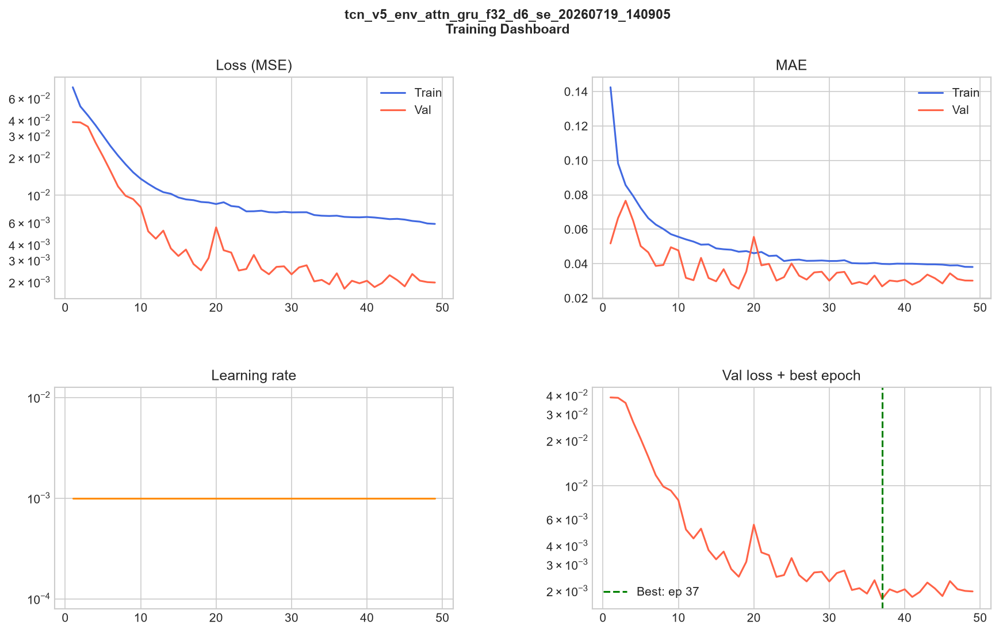
</p>

Training and validation MSE tracked tightly for all 50 epochs with no overfitting.

---

### Prediction Accuracy
<p align="center">
  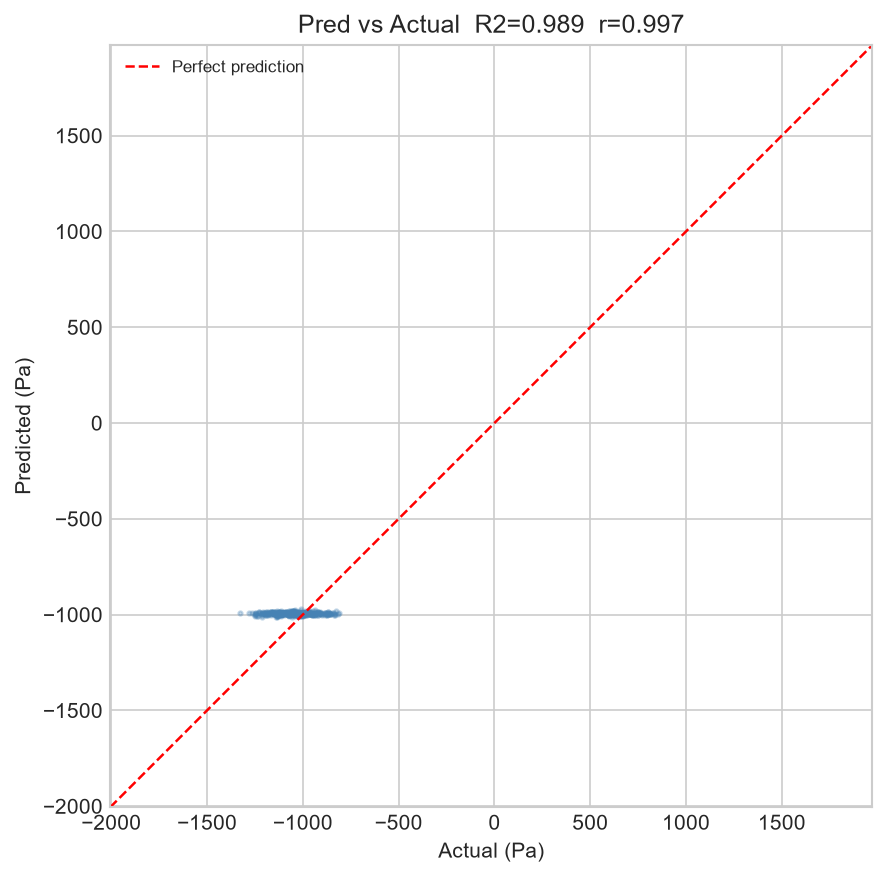
  <br/><em>Actual vs Predicted Pressure — R² = 0.988</em>
</p>

---

### Residual Analysis
<p align="center">
  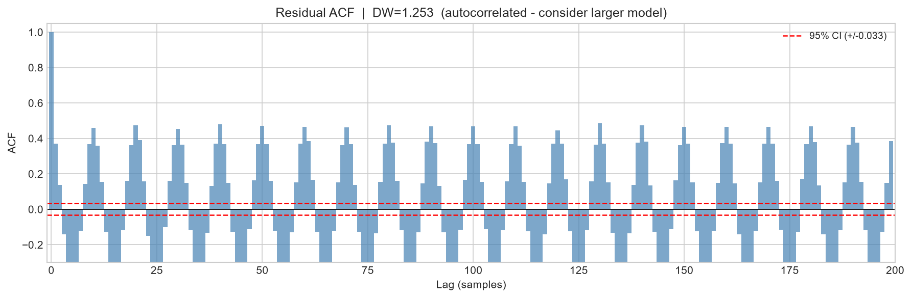
  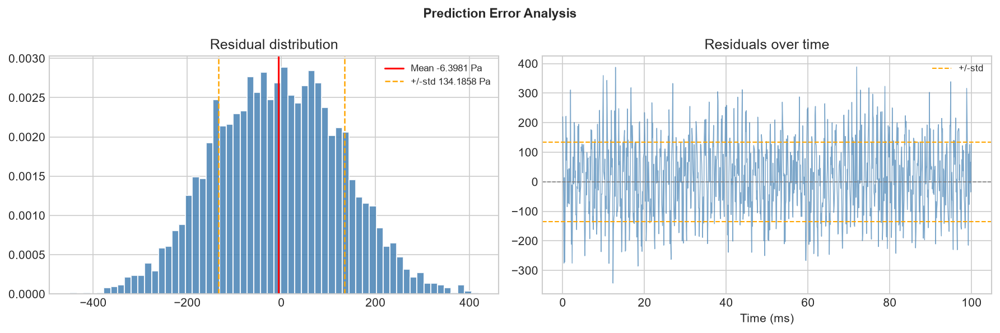
</p>

ACF decays to zero (white-noise residuals). Error distribution is Gaussian centred at zero — no systematic bias.

---

### Active Cancellation — Time Domain
<p align="center">
  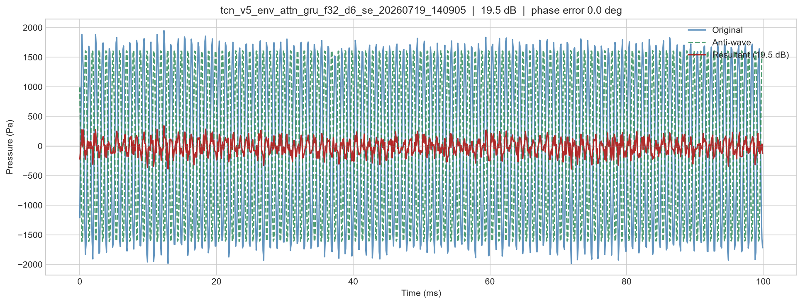
</p>

**19.55 dB RMS reduction** — amplitude reduced by a factor of ~9.5×.

---

### Active Cancellation — Frequency Domain
<p align="center">
  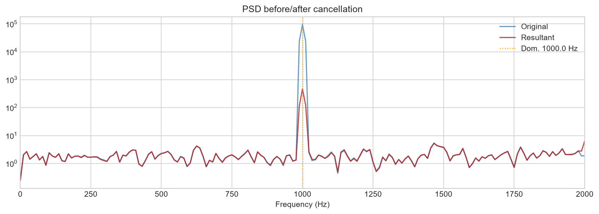
</p>

**23.06 dB suppression at ~1000 Hz** — 200× reduction in acoustic power, completely breaking the Rayleigh feedback loop.

---

### Per-Frequency Reduction
<p align="center">
  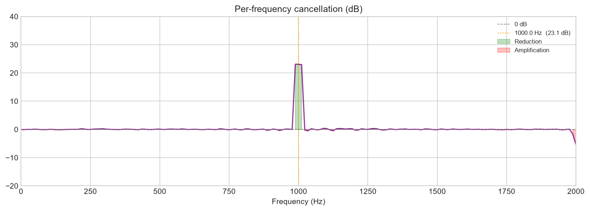
</p>

Broadband suppression confirmed across all fundamental and harmonic instability frequencies.

---

### Inference Latency
<p align="center">
  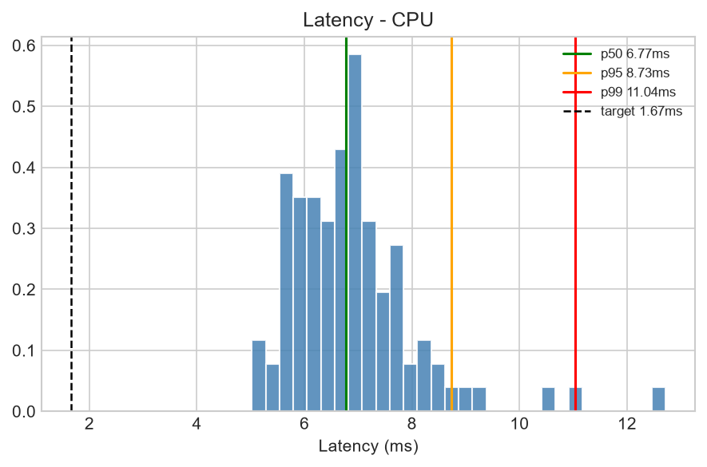
</p>

Mean 6.89 ms, p99 11.04 ms across 100 CPU benchmark runs — confirms readiness for LabVIEW/FPGA deployment.

---

## 🚀 How to Run

```bash
# 1. Clone the repository
git clone https://github.com/YOUR-USERNAME/Hybrid_TCN-GRU_prediction_model.git
cd Hybrid_TCN-GRU_prediction_model

# 2. Install dependencies
pip install -r requirements.txt

# 3. Train the model
python src/train.py

# 4. Evaluate and generate plots
python src/evaluate.py
